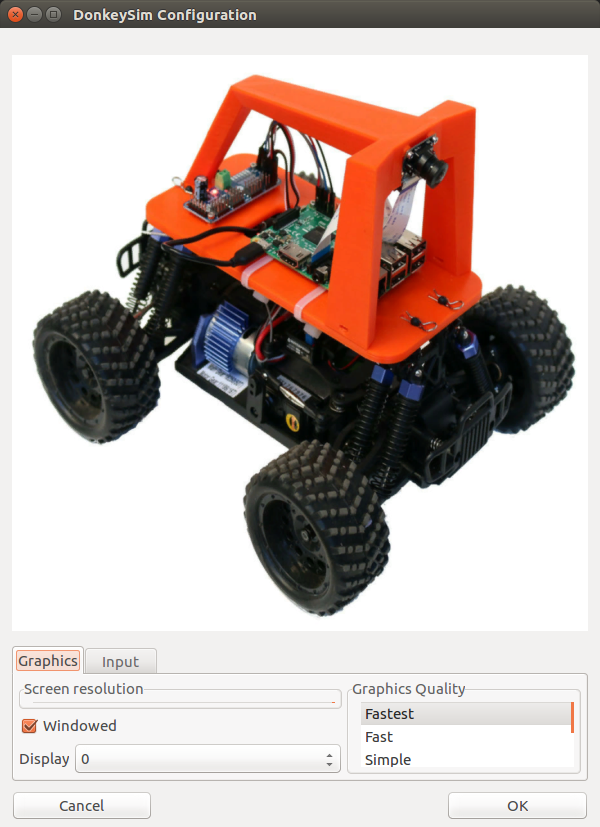
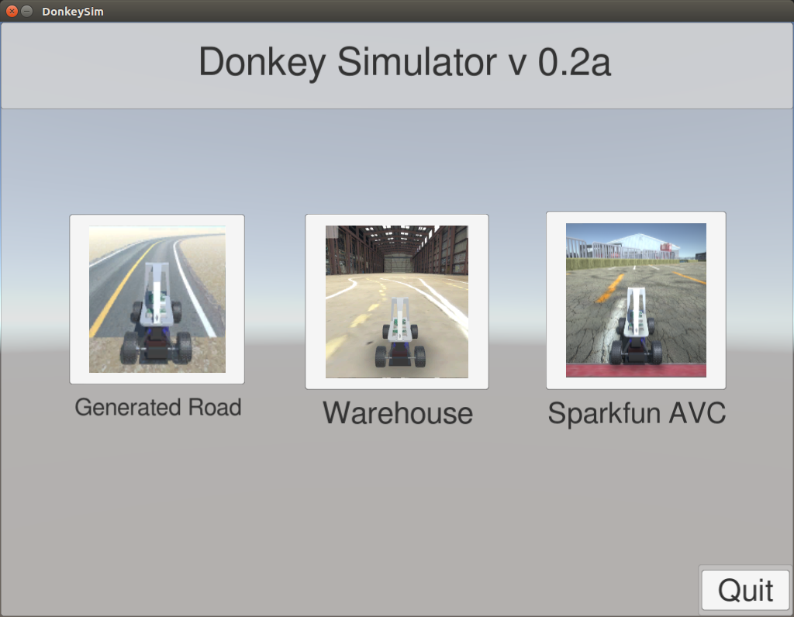
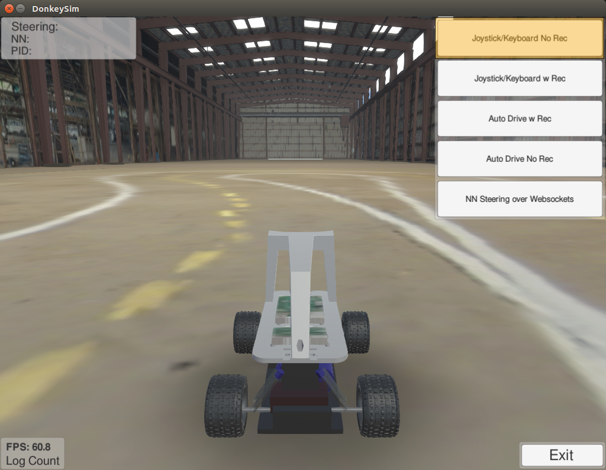
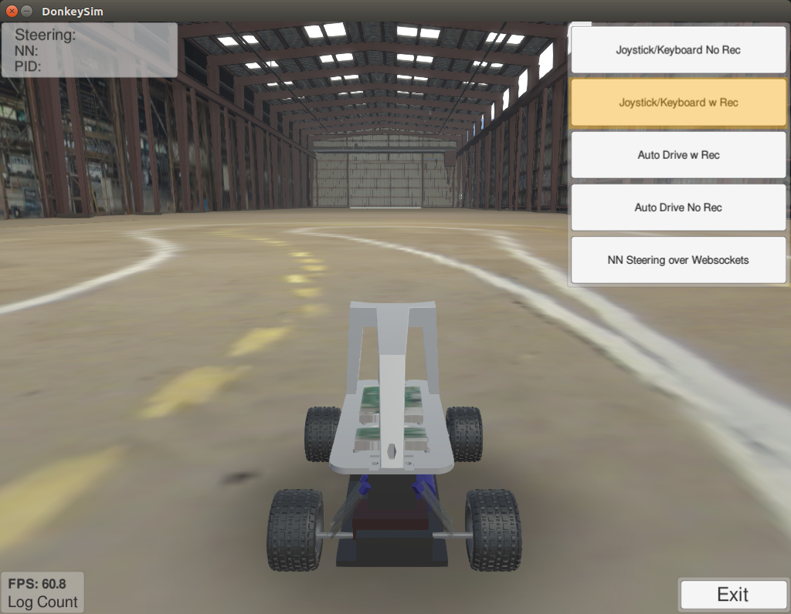
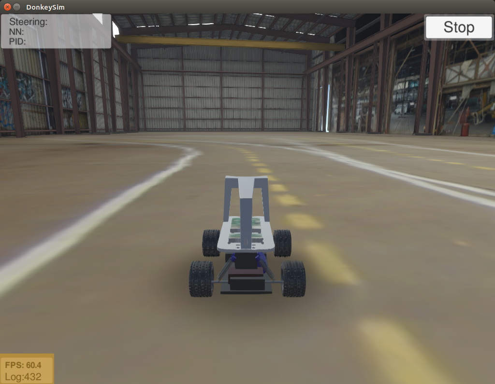
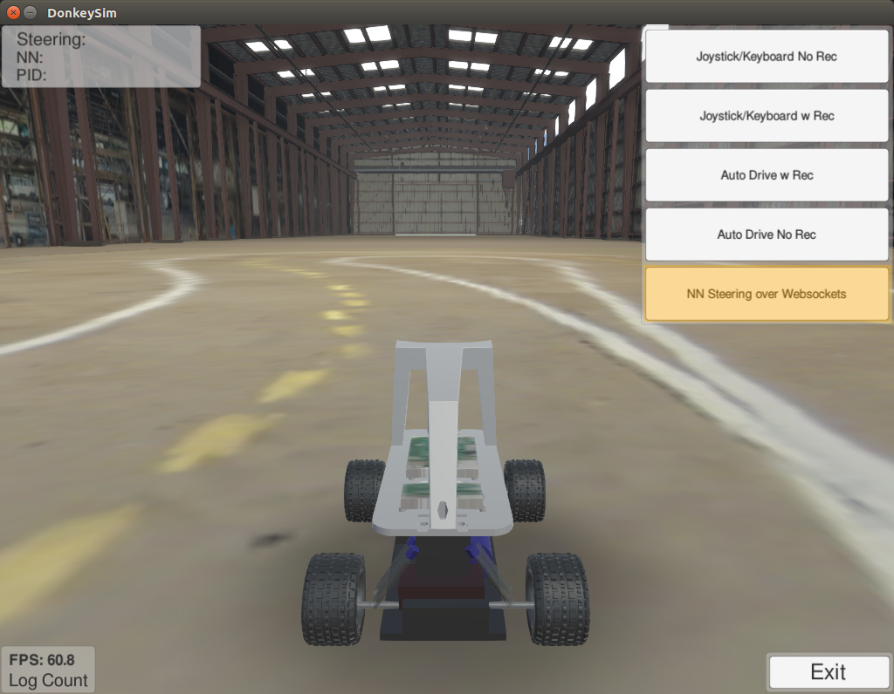

# Donkey Simulator

The donkeycar project provides a simulator for data collection and training in multiple environments.
It can be controlled manually, through pid, or nn over websockets.
The guide for the simulator is [here](http://docs.donkeycar.com/guide/simulator/).

## Install Simulator
- Download simulator for Ubuntu 16.04 [here](https://s3-us-west-1.amazonaws.com/kittcar.com/downloads/DonkeySimLinux.tar.gz).
  This version was tested in March 2018. [A newer version may be available](http://docs.donkeycar.com/guide/simulator/).
- Extract the download. This will create a new folder with executable and other assets.
  ```bash
  ~$ tar -xvf DonkeySimLinux.tar.gz 
  ~$ ls 
  DonkeySimLinux  DonkeySimLinux.tar.gz 
  ```
## Simulate
- ### Run the donkey sim executable.
  ```bash
  ~$ cd DonkeySimLinux 
  ~/DonkeySimLinux$ ./donkey_sim.x86_64 
  ```
- ### Choose configuration.  
  You will be presented with a configuration page to modify controls.  
  Accept the default.  
    
- ### Choose environment.  
  You will be asked which environment to simulate.  
  Select **Warehouse**  
    
- ### Drive!  
  You will be presented with the car on the track.  
  Choose **Joystick/Keyboard No Rec** to drive the robot without logging.  
  Use the arrow keys to drive the robot.  
  Left/Right keys will steer the robot. Releasing will restore the steering to center.  
  Up/Down keys will increase/decrease throttle. Releasing throttle **WILL NOT** stop the robot.  
  

## Install Donkeycar Library
- Install dependencies  
  ```bash
  ~$ sudo apt-get install virtualenv build-essential python3-dev gfortran libhdf5-dev 
  ~$ virtualenv env -p python3 
  ~$ source env/bin/activate 
  (env) ~$ pip install keras==2.0.6 
  (env) ~$ pip install tensorflow==1.3.0 
  ```
- Install donkey
  ```bash
  (env) ~$ git clone https://github.com/wroscoe/donkey.git 
  (env) ~$ pip install -e donkey/ 
  ```

## Collect Training Data
Once in an environment, choose **Joystick/Keyboard Rec**.  
This will log the image and command data to `DonkeySimLinux/log` if this directory exists.  
This folder will contain `jpg` images of what the robot saw and `json` files mapping these images to drive commands.  


Notice that while logging, the **Log Count** number will start increasing.  
Operate the robot until log count reaches 10,000.  

> *Note: 10,000 is the **MINIMUM** number of images needed. To have an effective training, much more is needed.*  



## Train
This section assumes you have installed the donkeycar library and simulator, and collected data.
- Create a new car.  
  ```bash
  (env) ~$  donkey createcar --path ~/mynewcar 
  ```
  A new folder will be created called mynewcar.
- Move training data to car.
  ```bash
  (env) ~$ cp -r ~/DonkeySimLinux/log/ ~/mynewcar/data/ 
  ```
- Train car.
  ```bash
  (env) ~$ cd ~/mynewcar 
  (env) ~/mynewcar$ python manage.py train --tub=data/log/ --model=models/mypilot 
  ```
  An output similar to below should be seen.
  ```bash
  Epoch 1/100 
  2018-03-18 12:28:22.781694: W tensorflow/core/platform/cpu_feature_guard.cc:45] The TensorFlow library wasn't compiled to use SSE4.1 instructions, but these are available on your machine and could speed up CPU computations. 
  2018-03-18 12:28:22.781718: W tensorflow/core/platform/cpu_feature_guard.cc:45] The TensorFlow library wasn't compiled to use SSE4.2 instructions, but these are available on your machine and could speed up CPU computations. 
  2018-03-18 12:28:22.781725: W tensorflow/core/platform/cpu_feature_guard.cc:45] The TensorFlow library wasn't compiled to use AVX instructions, but these are available on your machine and could speed up CPU computations. 
  2018-03-18 12:28:22.781730: W tensorflow/core/platform/cpu_feature_guard.cc:45] The TensorFlow library wasn't compiled to use AVX2 instructions, but these are available on your machine and could speed up CPU computations. 
  2018-03-18 12:28:22.781735: W tensorflow/core/platform/cpu_feature_guard.cc:45] The TensorFlow library wasn't compiled to use FMA instructions, but these are available on your machine and could speed up CPU computations. 
  42/69 [=================>............] - ETA: 30s - loss: 1.5613 - angle_out_loss: 1.7344 - throttle_out_loss: 0.3448 
  ```
  The amount of time to train will vary by computer and training data quality.

- When done, you will see something like
  ```bash
  Epoch 00021: early stopping 
  ```
  You should now be able to use your model.

## Drive with NN
- Ensure the environment simulator is running.  
  ```bash
  ~/DonkeySimLinux$ ./donkey_sim.x86_64 
  ```

- Start the robot simulator.  
  ```bash
  (env) ~/mynewcar$ donkey sim --model=models/mypilot 
  ```
  Wait to see  
  ```bash
  wsgi starting up on http://0.0.0.0:9090 
  ```
- Give control to the NN.  
  In the environment simulator, choose **NN Steering w Websockets**  
  
  The result should be something like [this](https://youtu.be/YP5ob7jX9g0).  
  The robot drives horribly, but it is clear that it is responding to its environment.
